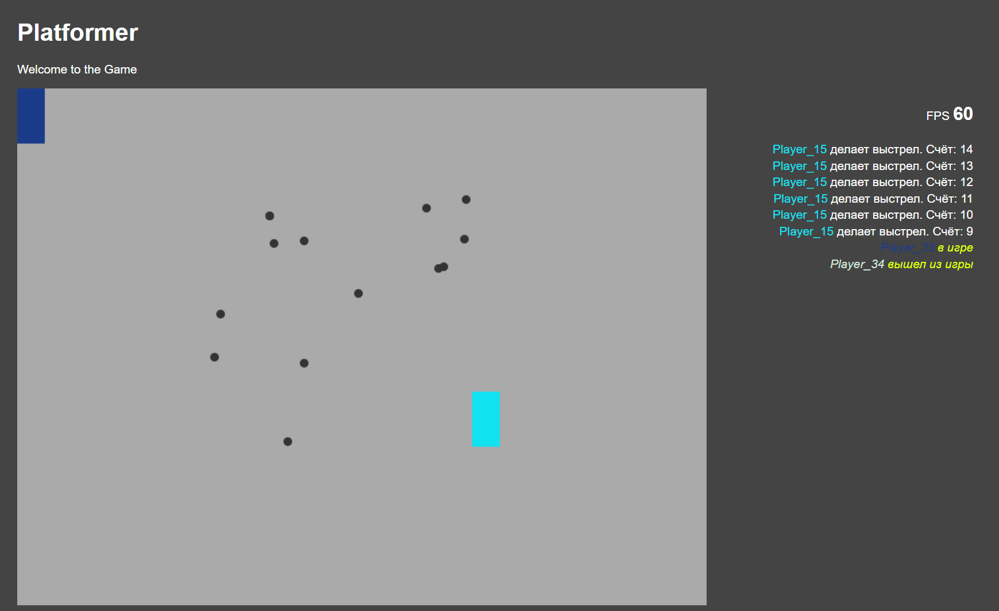
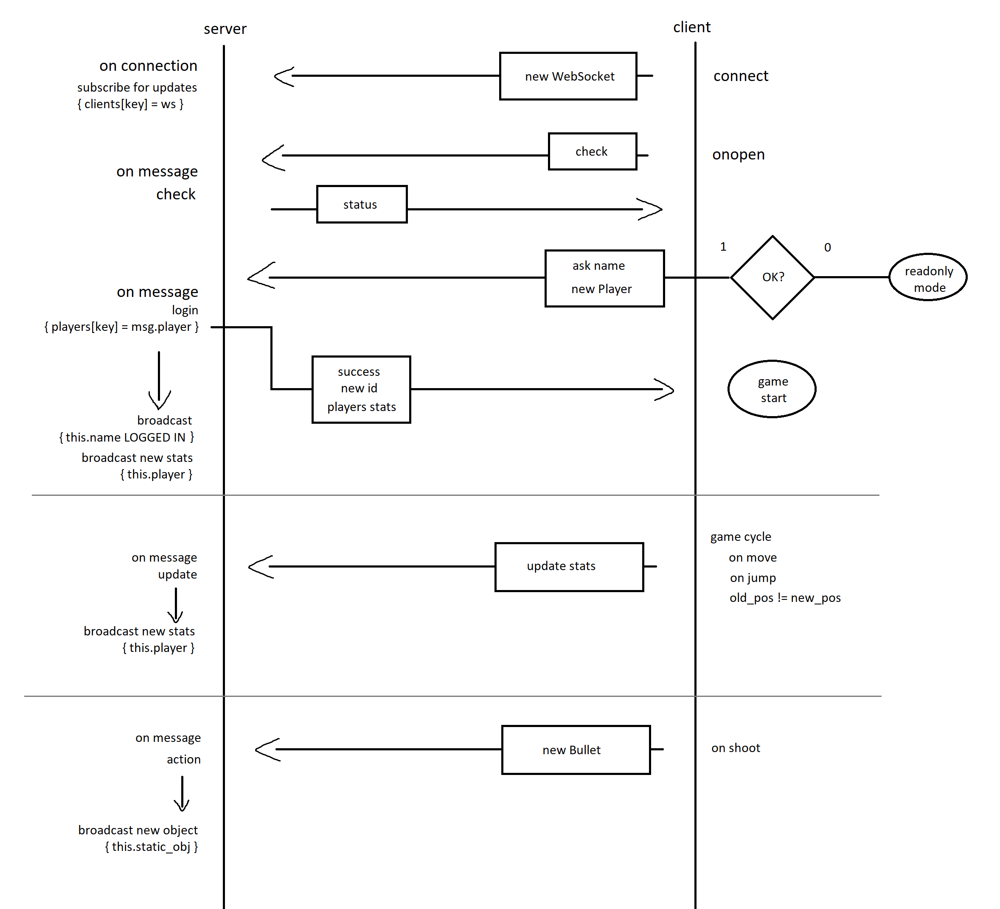

# canvas-game-platformer

Платформа для сетевых браузерных игр на базе Node.js, ES6, Socket.io, Canvas

### Упрощенная схема работы клиента и сервера

### Установка
1. Установить [Node.js](https://nodejs.org/en/download/).
2. Скачать или клонировать этот репозиторий.
3. Запустить `start.bat` из корня проекта. При первом запуске будет произведена установка необходимых модулей - дождитесь окончания процесса.
4. Перейти по адресу `http://localhost:3000`.
5. Следите за обновлениями.